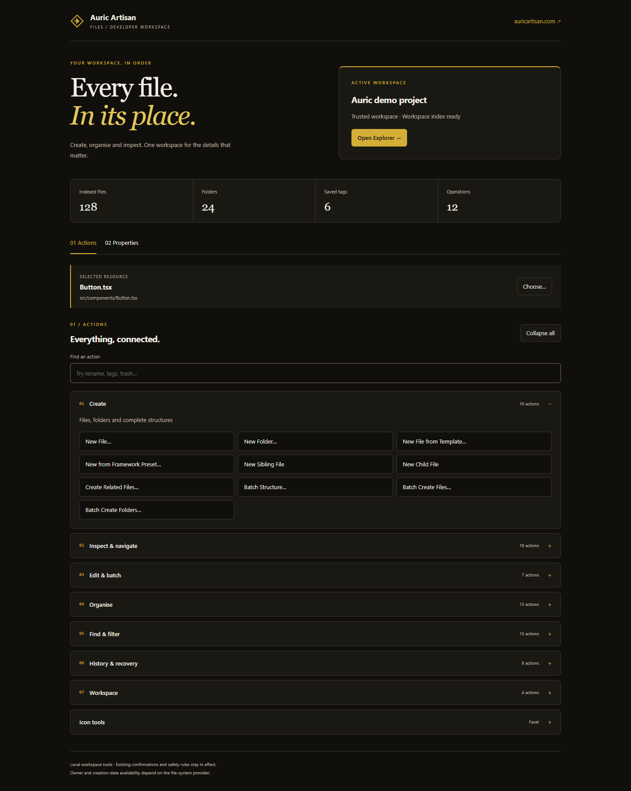
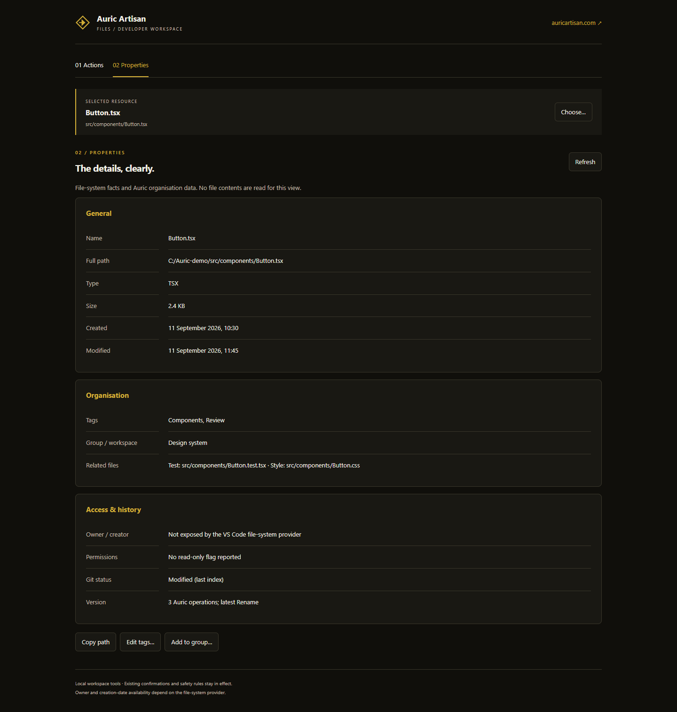

# Auric Artisan File System — v0.1.0 media

Every file. In its place.

Release screenshots for the File Workspace, graphical Properties, searchable action groups and Explorer companion sidebar.

[Extension source](https://github.com/auricartisan/Auric-Artisan-IDE-Plugins/tree/main/Auric-Artisan-File-System) · [Website](https://auricartisan.com) · [Release notes](https://github.com/auricartisan/Auric-Artisan-IDE-Plugins/blob/main/Auric-Artisan-File-System/CHANGELOG.md)

## Current interface



These are captures of the **actual extension webview renderer with illustrative sample data**, rendered in headless Microsoft Edge. They are not full VS Code application screenshots. Counts, dates, tags and paths are demonstration values. No private workspace data is captured, and no AI image generator is used.

| Asset | Purpose |
| --- | --- |
| [Workspace](media/marketplace/v0.1.0/workspace.png) | Brand header, workspace summary, selection and grouped tools |
| [Properties](media/marketplace/v0.1.0/properties.png) | General, Organisation, and Access & history cards |
| [Action search](media/marketplace/v0.1.0/action-search.png) | Batch tools filtered across groups |
| [Sidebar](media/marketplace/v0.1.0/sidebar.png) | Compact 360px companion view |
| [Integrity manifest](media/marketplace/v0.1.0/RELEASE-MEDIA.json) | SHA-256 hashes, dimensions, file sizes and provenance |

## Properties



## Reproduce and verify

In the extension source directory:

```sh
npm ci
npm run media:capture
npm run release:check
```

Windows capture uses installed Edge; other systems use Playwright Chromium. Capture code is in [scripts/capture-release.cjs](https://github.com/auricartisan/Auric-Artisan-IDE-Plugins/blob/main/Auric-Artisan-File-System/scripts/capture-release.cjs).

The release check compares the source-kit PNGs with the manifest and this checkout when available. After pushing the media and source repositories, run `npm run release:verify-public` to verify public image hashes and documentation URLs.

## Stable image base

```text
https://raw.githubusercontent.com/auricartisan/Auric-Artisan-Media/main/file-system/media/marketplace/v0.1.0/
```

These versioned paths are referenced from the extension README and excluded from its VSIX. A local copy here does not make them publicly available until the media repository is pushed.

## Earlier workflow assets

[Earlier video](media/marketplace/full-walkthrough.mp4) · [Poster](media/marketplace/video-poster.png) · [SRT captions](media/marketplace/full-walkthrough.srt) · [Transcript](media/marketplace/TRANSCRIPT.md) · [Screenshot directory](media/marketplace/screenshots/)

Earlier recordings use the previous menu layout. They have not been re-recorded or relabelled as v0.1.0. [Historical media notes](LEGACY-MEDIA-NOTES.md) are preserved separately; unavailable chapter, music and guide files are not advertised as current release assets.

The extension's existing [licence](https://github.com/auricartisan/Auric-Artisan-IDE-Plugins/blob/main/Auric-Artisan-File-System/LICENSE.txt) is unchanged by this media update.
