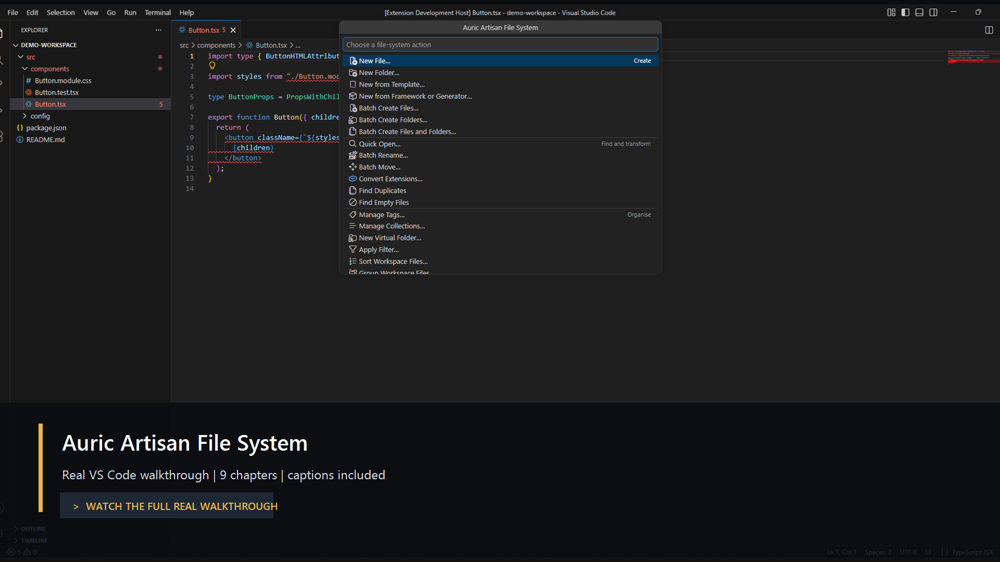
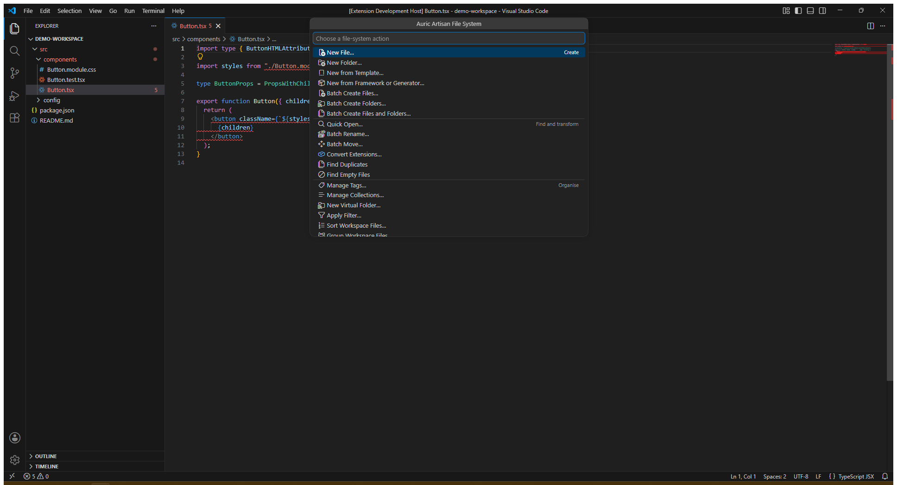
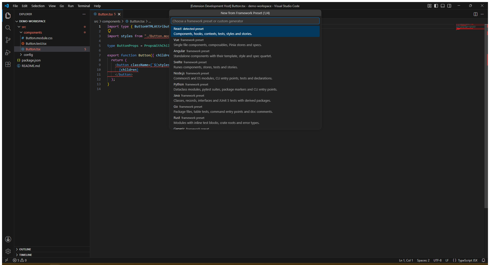
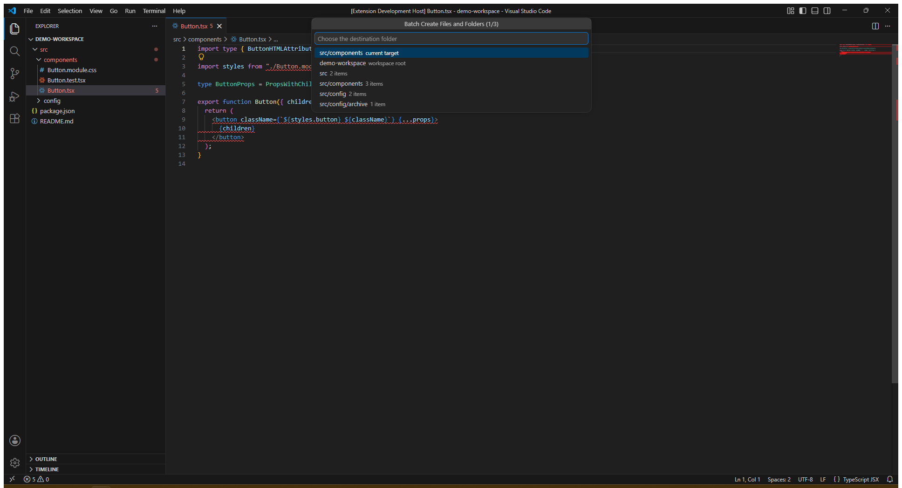
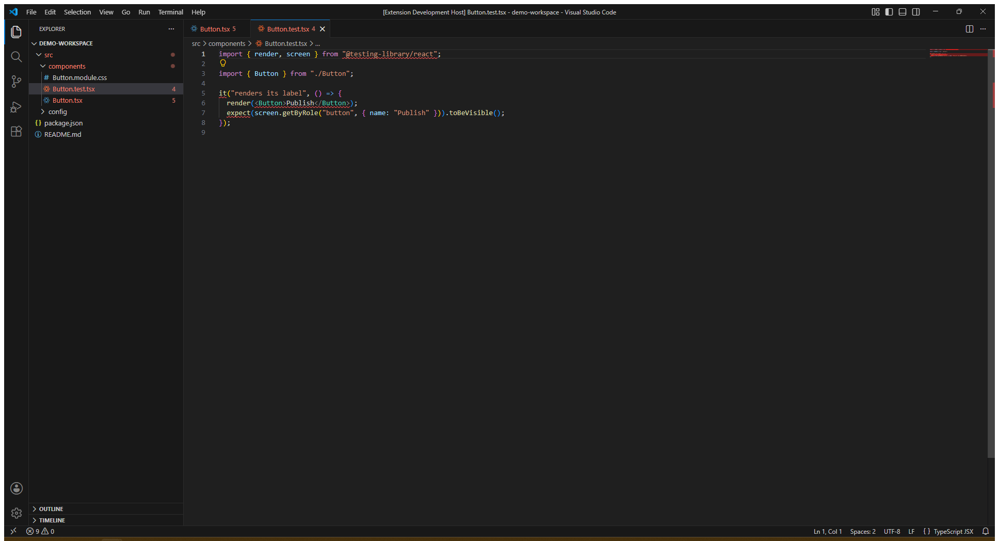
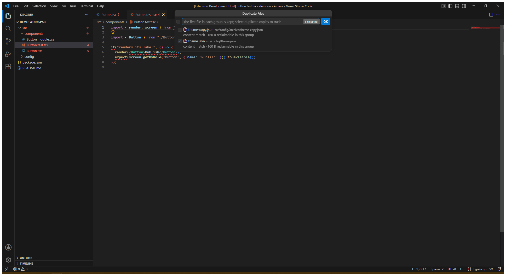

# Auric Artisan File System — visual media

The 1 minute 34 second walkthrough is a 1920 × 1040 H.264 recording of the
running extension. Explanations are burned into the video.

[Watch or download the MP4](media/marketplace/full-walkthrough.mp4)
· [Read the transcript](media/marketplace/TRANSCRIPT.md)
· [Download SRT captions](media/marketplace/full-walkthrough.srt)

## Full-size chapter captures

### Command centre

### Framework presets

### Batch creation

### Related files

### Duplicate detection

All screens are real VS Code Extension Development Host captures. The poster is
composed from the real command-centre screenshot. No image is AI-generated.
