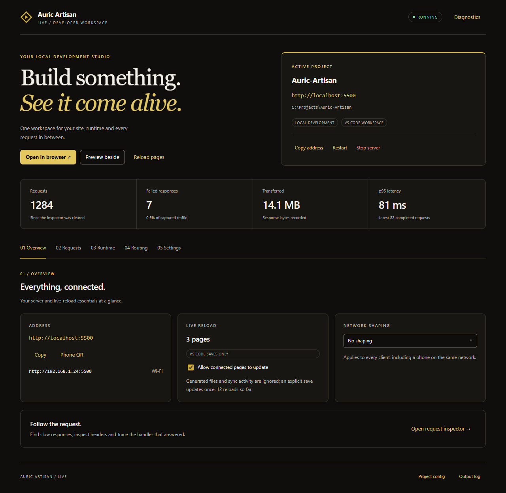
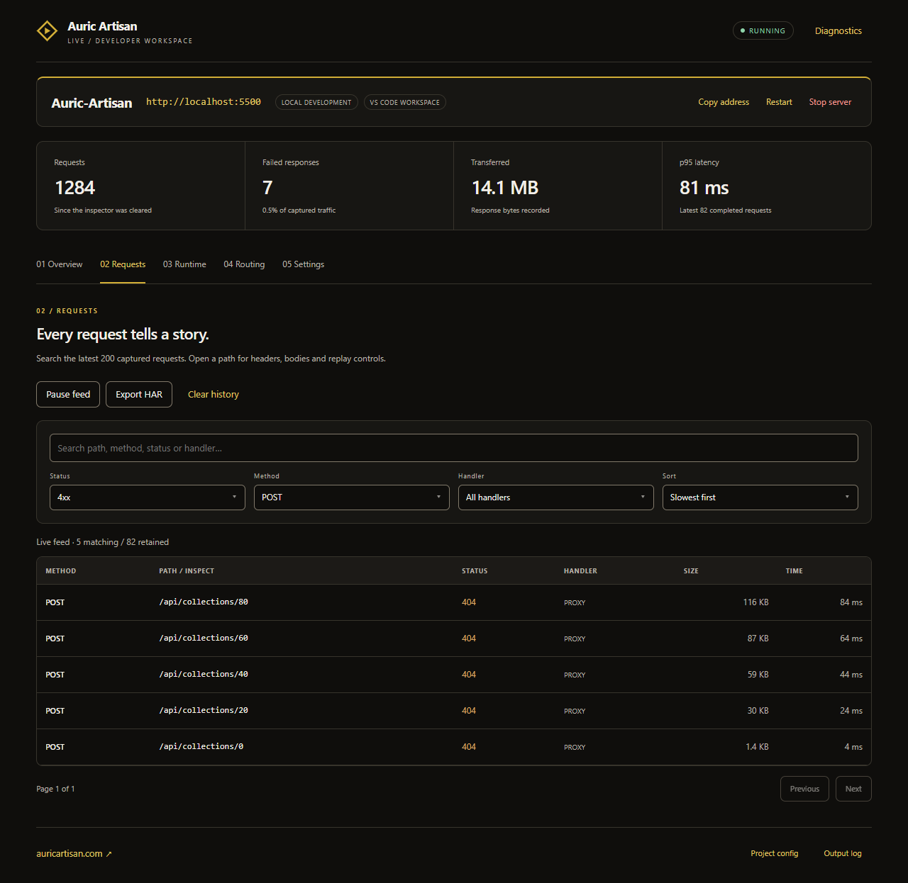
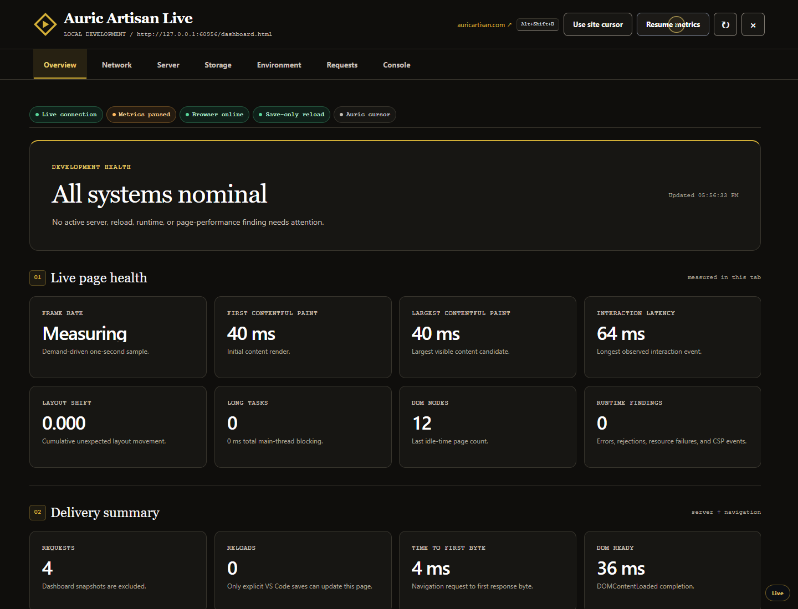
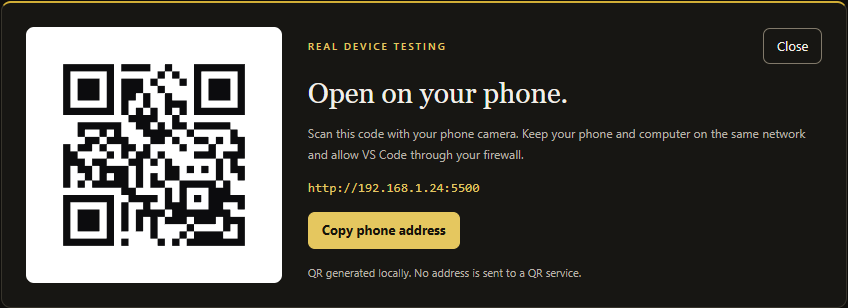
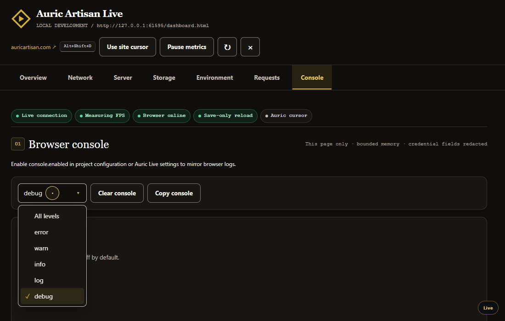
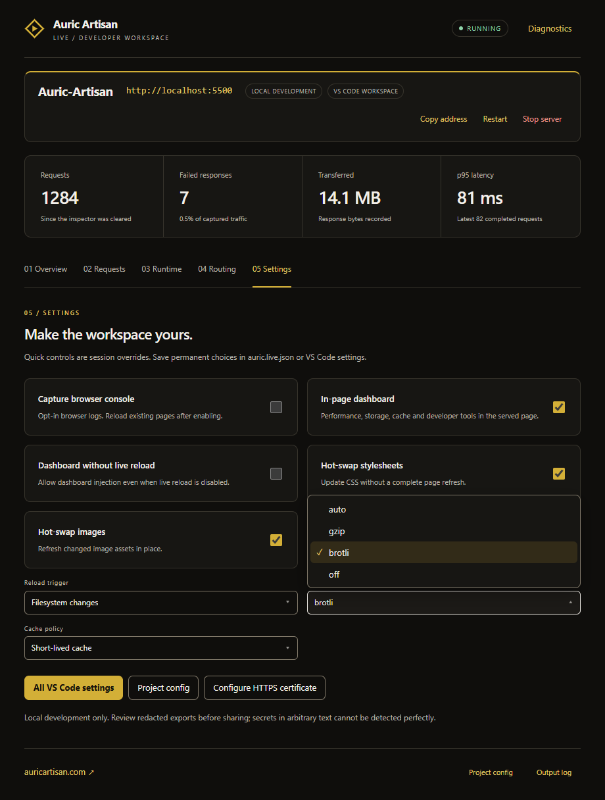

# Auric Artisan Live — Media Kit

Current screenshots for **v0.2.0**, showing the redesigned development workspace,
browser dashboard, inline phone QR and custom dropdowns.

[Marketplace](https://marketplace.visualstudio.com/items?itemName=auric-artisan.auric-artisan-live) · [Auric Artisan](https://auricartisan.com/) · [Screenshot files](media/)

## Development workspace



The control panel brings project controls, request totals, live reload and network
shaping into one workspace. These are real extension bundles rendered in a browser
test harness with demonstration data, not an actual VS Code window.

## Screenshot collection

| View | Image | What it shows |
| --- | --- | --- |
| Workspace | [studio-overview.png](media/studio-overview.png) | Project controls, metrics and live-reload settings. |
| Request inspector | [studio-requests.png](media/studio-requests.png) | Combined filters, response handlers, size and timing. |
| Browser dashboard | [dashboard-website-desktop.png](media/dashboard-website-desktop.png) | Page health, browser measurements and delivery summaries. |
| Phone QR | [studio-inline-phone-qr.png](media/studio-inline-phone-qr.png) | Inline QR, demonstration LAN address and copy controls. |
| Console | [dashboard-console-fixed.png](media/dashboard-console-fixed.png) | Grouped actions and an unclipped log-level menu. |
| Settings | [studio-custom-dropdowns.png](media/studio-custom-dropdowns.png) | Session settings and the OneDrop compression menu. |

### Request inspection



### Browser diagnostics



### Real-device connection



<details>
<summary>Console and custom settings menus</summary>





</details>

## Provenance

- Captured from the shipped extension UI or a locally served diagnostic fixture.
- No AI-generated or retouched product screenshots.
- Workspace names, paths, QR addresses and traffic are demonstration fixtures.
- Metrics illustrate the interface; they are not performance benchmarks.
- [SCREENSHOTS.json](media/SCREENSHOTS.json) records source filenames, byte sizes
  and SHA-256 hashes for this collection.

## Public image URLs

Use the raw GitHub URL when embedding an image in a Marketplace or extension README:

```text
https://raw.githubusercontent.com/auricartisan/Auric-Artisan-Media/main/live/media/studio-overview.png
```

Replace the final filename with any image in the collection. Files are ordinary
PNG assets, not Git LFS pointers. The extension's VSCE image base remains:

```text
https://raw.githubusercontent.com/auricartisan/Auric-Artisan-Media/main/live
```

## Earlier walkthrough — v0.1.0

The existing walkthrough and media remain available for reference. They show an
earlier interface; use the screenshots above for the current release.

<details>
<summary>Video, captions and earlier documentation</summary>

[](media/marketplace/full-walkthrough.mp4)

- [Watch or download the 4:20 walkthrough](media/marketplace/full-walkthrough.mp4)
- [Written guide](media/marketplace/FULL-GUIDE.md)
- [Transcript](media/marketplace/TRANSCRIPT.md)
- [SRT captions](media/marketplace/full-walkthrough.srt) · [WebVTT captions](media/marketplace/full-walkthrough.vtt)
- [Earlier screenshot gallery](media/marketplace/screenshots/)
- [Music provenance](media/marketplace/MUSIC.md)
- [Earlier asset manifest](media/marketplace/ASSET-MANIFEST.json)

</details>
