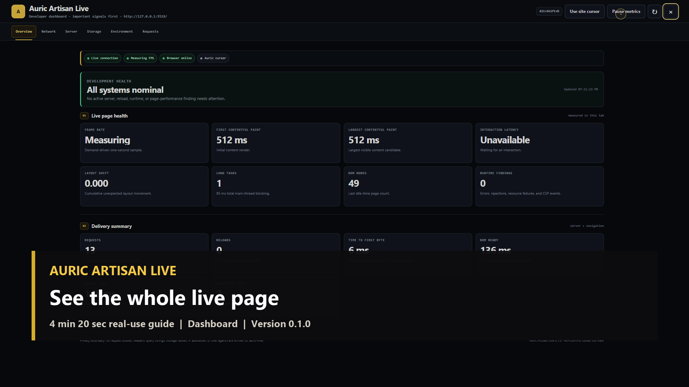
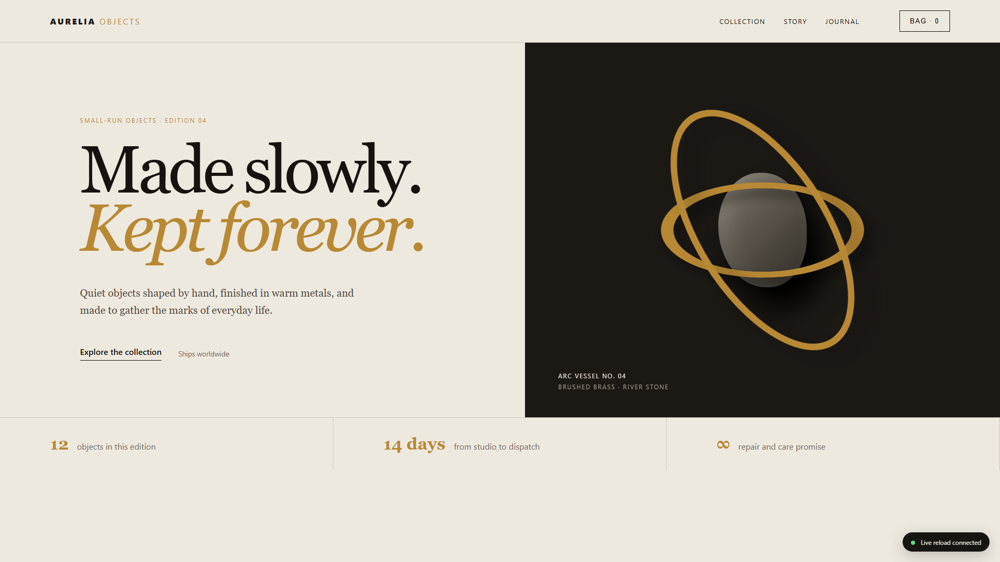
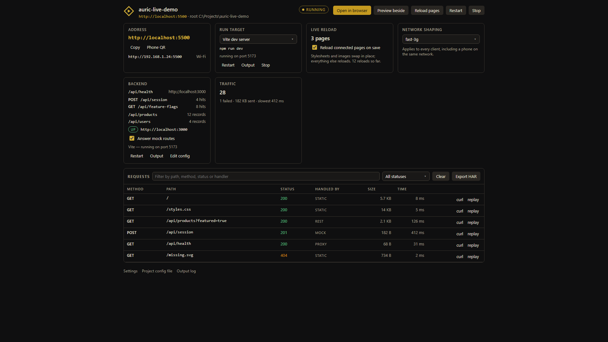
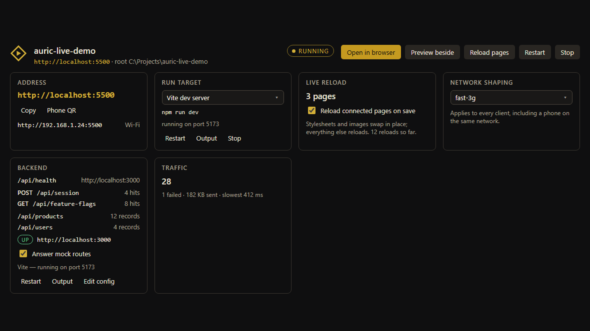
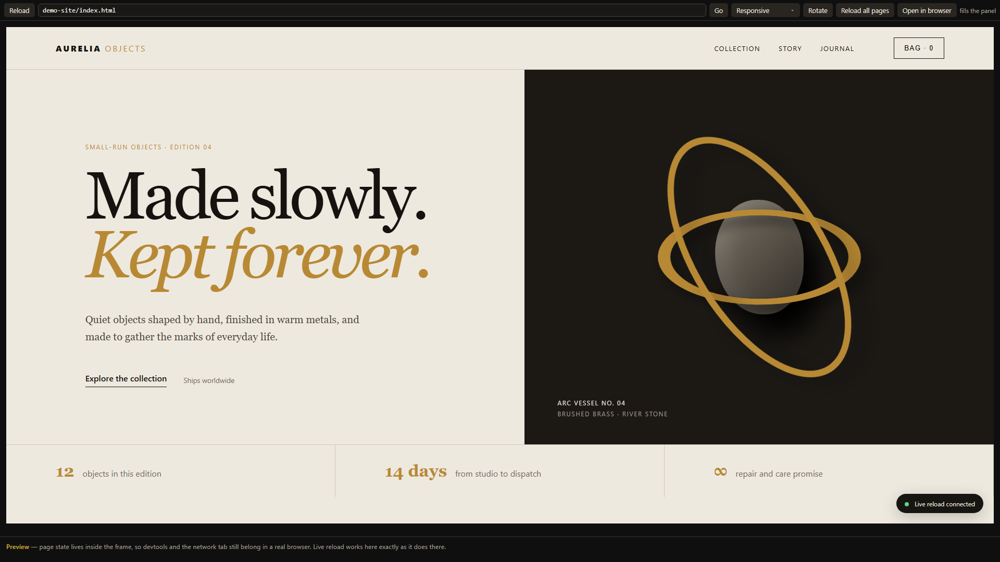
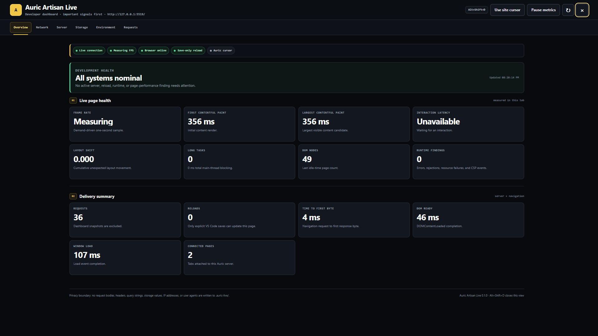
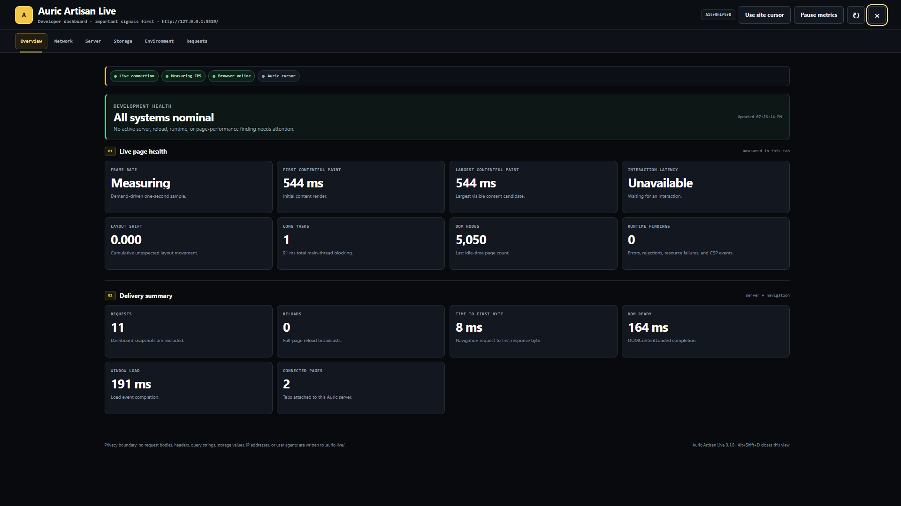

# Auric Artisan Live 0.1.0 — media kit

Publication-ready video, images, captions, and documentation for Auric Artisan
Live. The guide begins with a real website folder and follows the complete
developer workflow: Go Live, stable reloads, the in-page dashboard, cache and
network evidence, storage records, responsive preview, proxy/mock APIs, request
inspection, ignore rules, and performance testing.

## Watch the complete real-use guide

[](media/marketplace/full-walkthrough.mp4)

**[Watch or download the 4:20 MP4](media/marketplace/full-walkthrough.mp4)**

The 1920×1080 H.264 video includes a paced original soundtrack, visible chapter
guidance, and a complete workflow from an empty local serving session through
advanced developer inspection. Select the poster above to open the video.

## Follow the full guide

| Resource | Open |
| --- | --- |
| Complete 4:20 walkthrough | [MP4 video](media/marketplace/full-walkthrough.mp4) |
| Start-to-finish written guide | [FULL-GUIDE.md](media/marketplace/FULL-GUIDE.md) |
| Action-by-action timeline | [TRANSCRIPT.md](media/marketplace/TRANSCRIPT.md) |
| Accessible captions | [SRT](media/marketplace/full-walkthrough.srt) · [WebVTT](media/marketplace/full-walkthrough.vtt) |
| Embedded chapter source | [chapters.ffmeta](media/marketplace/chapters.ffmeta) |
| Original music provenance | [MUSIC.md](media/marketplace/MUSIC.md) |
| All eleven full-resolution captures | [Real-use screenshot gallery](media/marketplace/screenshots/) |
| File hashes and technical metadata | [ASSET-MANIFEST.json](media/marketplace/ASSET-MANIFEST.json) |

The transcript and caption files provide text alternatives to the video. The
written guide can also be followed independently as a build-along reference.

## Real-use image gallery

Every image opens at full resolution.

| Served site and Go Live | Extension control panel |
| --- | --- |
| [](media/marketplace/screenshots/01-served-site.png) | [](media/marketplace/screenshots/02-control-panel.png) |
| **Live reload and network activity** | **Responsive preview** |
| [](media/marketplace/screenshots/03-live-reload-and-network.png) | [](media/marketplace/screenshots/06-responsive-preview.png) |
| **Developer dashboard** | **Performance stress test** |
| [](media/marketplace/screenshots/09-developer-dashboard.png) | [](media/marketplace/screenshots/11-performance-stress-test.png) |

The [complete gallery](media/marketplace/screenshots/) also covers proxy, mock,
and REST configuration; the request inspector; phone preview; local storage
records; and cursor control.

## What the walkthrough demonstrates

- one stable reload per meaningful save, plus CSS and image hot swapping;
- a demand-driven dashboard for health, FPS, paint timing, interaction delay,
  layout shift, long tasks, DOM size, and runtime findings;
- measured network transfer data, cache estimates, and server-confirmed cache
  validation kept clearly separate;
- `.auric-live/` session records and `.auricignore-live` serving, watching,
  reload, and recording controls;
- responsive and phone previews, proxy fallback, mock endpoints, a JSON REST
  surface, and sanitized request inspection;
- an optional Auric cursor that can be returned to the website cursor instantly
  and preserves native behavior for accessibility-sensitive environments.

## Provenance and integrity

All product visuals were captured from the real extension bundles running with
a disposable local demo site. No screenshot, poster, or video frame is
AI-generated. The soundtrack is original procedural audio made without external
music, samples, loops, or AI-generated audio.

The version, duration, codecs, resolution, byte counts, and SHA-256 hashes are
recorded in [ASSET-MANIFEST.json](media/marketplace/ASSET-MANIFEST.json).

VSCE media base URL:

```text
https://raw.githubusercontent.com/auricartisan/Auric-Artisan-Media/main/live
```
