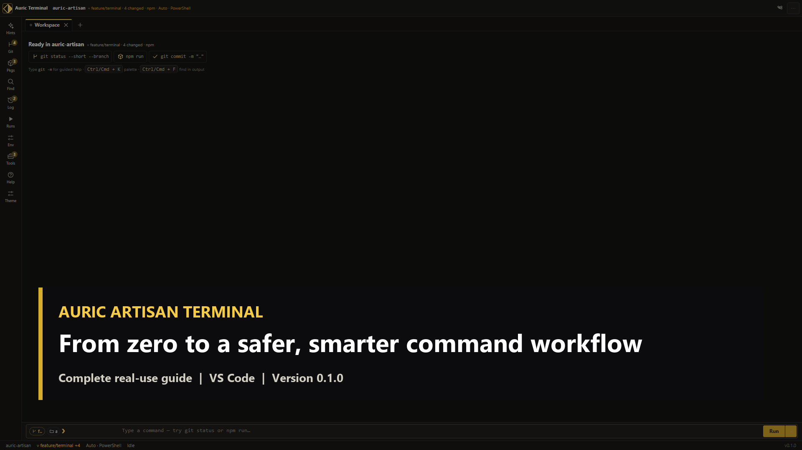

# Auric Artisan Terminal — media kit

Public, publication-ready media for Auric Artisan Terminal `0.1.0`.

| Resource | Open |
| --- | --- |
| Complete 3:36 walkthrough | [Watch or download MP4](media/marketplace/full-walkthrough.mp4) |
| Reproducible build-along | [FULL-GUIDE.md](media/marketplace/FULL-GUIDE.md) |
| Timed written tour | [TRANSCRIPT.md](media/marketplace/TRANSCRIPT.md) |
| Accessible captions | [SRT](media/marketplace/full-walkthrough.srt) · [WebVTT](media/marketplace/full-walkthrough.vtt) |
| Chapters | [chapters.ffmeta](media/marketplace/chapters.ffmeta) |
| Music provenance | [MUSIC.md](media/marketplace/MUSIC.md) |
| Visual overview | [Poster](media/marketplace/video-poster.png) · [Contact sheet](media/marketplace/contact-sheet.png) · [Screenshots](media/marketplace/screenshots/) |
| Integrity | [ASSET-MANIFEST.json](media/marketplace/ASSET-MANIFEST.json) |

Every product frame is captured from the extension’s actual webview bundle.
No product image is AI-generated. The soundtrack is an original deterministic
procedural composition with no external samples, loops, or AI-generated audio.
