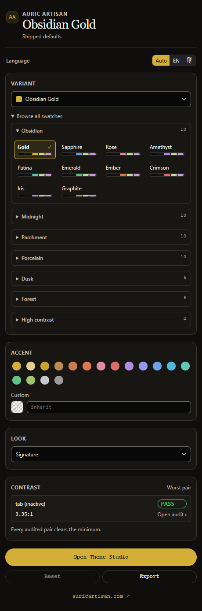

# Auric Artisan Theme · 0.2.0

54 built-in variants, six surface families and two high-contrast builds. These screenshots show the actual extension webview renderer with generated theme data and a simulated VS Code bridge.

## Gallery

| Image | View |
| --- | --- |
| [Studio](studio-overview.png) | Dark Studio and its six tabs |
| [Comparison](studio-preview.png) | Shipped and current palette specimens |
| [Colour picker](studio-picker.png) | Custom picker and numeric RGB channels |
| [Families](sidebar-families.png) | Compact, collapsible accent galleries |
| [हिन्दी](sidebar-hindi.png) | Hindi family labels and sidebar controls |
| [Light Studio](studio-light.png) | Porcelain Sapphire light interface |

## हिन्दी

54 तैयार थीम, छह परिवार और दो उच्च-कॉन्ट्रास्ट विकल्प। हर परिवार के छोटे समूह में उसके एक्सेंट मिलते हैं। हिन्दी नाम थीम चयनकर्ता और पैनलों में एक जैसे हैं।

ये स्क्रीनशॉट वास्तविक वेबव्यू रेंडरर और नमूना होस्ट डेटा से लिए गए हैं; ये इंस्टॉल किए हुए VS Code विंडो के स्क्रीनशॉट नहीं हैं।

## Provenance

Captured with `Auric-Artisan-Theme/build/release-media.cjs` using installed headless Edge. No AI-generated artwork or private workspace data is included. SHA-256 hashes and dimensions are recorded in `SCREENSHOTS.json`. Existing marketplace artwork is retained.

[Website](https://auricartisan.com) · [Extension](https://marketplace.visualstudio.com/items?itemName=auric-artisan.auric-artisan-theme)
